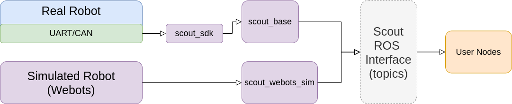

# ROS Packages for Scout Mobile Base

## Packages

* scout_bringup: launch and configuration files to start ROS nodes 
* scout_base: a ROS wrapper around Scout SDK to monitor and control the robot
* scout_sdk: Scout SDK customized for ROS
* scout_msgs: scout related message definitions
* (scout_ros: meta package for the Scout robot ROS packages)

The following diagram may help you to understand how the components are inter-connected with each other:



The purple blocks represent ROS packages included within this repository.

## Communication interface setup

### Setup CAN-To-USB adapter 

1. Enable gs_usb kernel module
   
    ```
    $ sudo modprobe gs_usb
    ```

2. Bringup can device
   
   ```
   $ sudo ip link set can0 up type can bitrate 500000
   ```

3. If no error occured during the previous steps, you should be able to see the can device now by using command
   
   ```
   $ ifconfig -a
   ```

4. Install and use can-utils to test the hardware
   
    ```
    $ sudo apt install can-utils
    ```

5. Testing command
   
    ```
    # receiving data from can0
    $ candump can0
    # send data to can0
    $ cansend can0 001#1122334455667788
    ```

Two scripts inside the "scout_bringup/scripts" folder are provided for easy setup. You can run "./setup_can2usb.bash" for the first-time setup and run "./bringup_can2usb.bash" to bring up the device each time you unplug and re-plug the adapter.

## Basic usage of the ROS package

1. Install dependent ROS packages

    ```
    $ sudo apt install ros-melodic-teleop-twist-keyboard
    $ sudo apt-get install ros-melodic-joint-state-publisher-gui
    $ sudo apt install ros-melodic-ros-controllers
    $ sudo apt install ros-melodic-webots-ros
    ```

    Change ros-melodic-* in the command to ros-kinetic-* if you're using ROS Kinetic.


2. Clone the packages into your catkin workspace and compile

    (the following instructions assume your catkin workspace is at: ~/catkin_ws/src)

    ```
    $ cd ~/catkin_ws/src
    $ git clone https://github.com/agilexrobotics/scout_mini_ros.git
    $ cd ..
    $ catkin_make
    ```

3. Launch ROS nodes

* Start the base node for the real robot

    ```
    $ roslaunch scout_bringup scout_minimal.launch
    ```

* Start the keyboard tele-op node

    ```
    $ roslaunch scout_bringup scout_teleop_keyboard.launch
    ```

4. Setup gazebo simulation
* Start the gazebo simulation node
    ```
    $ roslaunch scout_bringup scout_mini_base_gazebo_sim.launch
    ```


    **SAFETY PRECAUSION**: 
    
    The default command values of the keyboard teleop node are high, make sure you decrease the speed commands before starting to control the robot with your keyboard! Have your remote controller ready to take over the control whenever necessary. 
